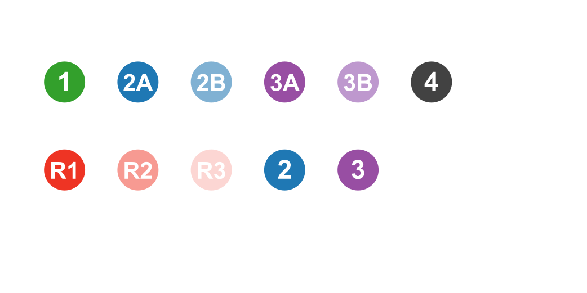
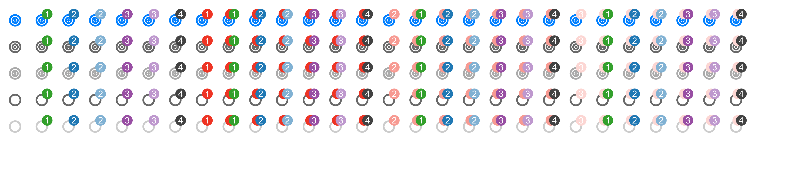

# OncoKB Styles

## Use level icon
Please include class name `oncokb level-icon level-{level}`  
The possible level values are 1, 2, 2A, 2B, 3, 3A, 3B, 4, R1, R2 and R3

Example:  
When showing level 1, you should use `oncokb level-icon level-1`  

Here is all possible icons:  

## Use annotation icon
Please include class name `oncokb annotation-icon {oncogenicity} level{-sensitive level}{-resistance level}`  
The possible oncogenicity values are `oncogenic`, `neutral`, `inconclusive`, `vus`, `unknown`  
The possible sensitive level values are 1, 2A, 2B, 3A, 3B, 4  
The possible resistance level values are R1, R2, R3  

Example:  
When the annotation shows oncogenic, highest sensitive level is 3A, highest resistance level is R2, you should use `oncokb annotation-icon oncogenic level-3A-R2` 

Here is all possible icons:  

## SVG images
These images are converted by using https://image.online-convert.com/convert-to-png