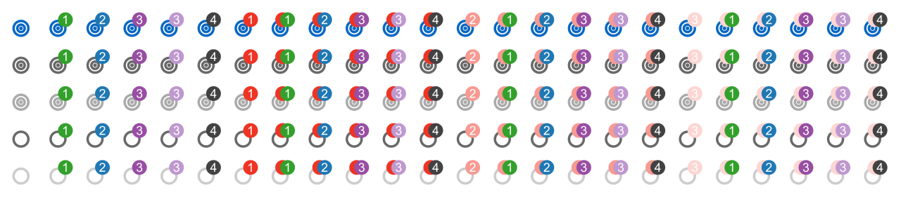

# OncoKB Styles

## Status
  

## Use css colors
Please use class name `oncokb {color}`

| Category     | Possible Values to replace {color}                                                                                                                     |
|--------------|--------------------------------------------------------------------------------------------------------------------------------------------------------|
| oncogenicity | oncogenic, likely-oncogenic, resistance, neutral, likely-neutral, inconclusive, vus, unknown                                                           |
| level        | level-1, level-2, level-3, level-3A, level-3B, level-4, level-R1, level-R2, level-R3, level-Dx1, level-Dx2, level-Dx3, level-Px1, level-Px2, level-Px3 |

### Example
Use the color for oncogenic `oncokb oncogenic`

## Use icon
Please use class name `oncokb icon {icon-name}`

| Category           | Possible values to replace {icon-name}                                                       |
|--------------------|----------------------------------------------------------------------------------------------|
| Oncogenicity       | oncogenic, likely-oncogenic, resistance, neutral, likely-neutral, inconclusive, vus, unknown |
| Therapeutic Levels | level-1, level-2, level-3, level-3A, level-3B, level-4, level-R1, level-R2, level-R3         |
| Diagnostic Levels  | level-Dx1, level-Dx2, level-Dx3                                                              |
| Prognostic Levels  | level-Px1, level-Px2, level-Px3                                                              |

### Example
When showing level 1 icon, you should use `oncokb icon level-1`

### Icons


## Use annotation icon
Please use class name `oncokb annotation-icon {oncogenicity} level{-sensitive level}{-resistance level}`  
The list of icons are for oncogenicity and therapeutic levels. Dx/Px are not included, use [Icons](#icons) above instead.  


| Variable         | Possible values to replace                                                                   |
|------------------|----------------------------------------------------------------------------------------------|
| oncogenicity     | oncogenic, likely-oncogenic, resistance, neutral, likely-neutral, inconclusive, vus, unknown |
| sensitive level  | 1, 2, 3, 3A, 3B, 4                                                                           |
| resistance level | R1, R2, R3                                                                                   |

## Scaling 

For any icon you may scale it up or down by a numerical factor. Simply set the `--scaling-factor` css variable on your HTML element. For example, to double the size of an icon, you may write:
```html
<span class="oncokb icon oncogenic" style="--scaling-factor: 2"></span>
```

### Example
When the annotation shows oncogenic, highest sensitive level is 3A, highest resistance level is R2, you should use `oncokb annotation-icon oncogenic level-3A-R2` 
When the annotation with only oncogenicity, you should use `oncokb annotation-icon oncogenic no-level`

### Icons


## SVG images
These images are converted by using https://image.online-convert.com/convert-to-png
